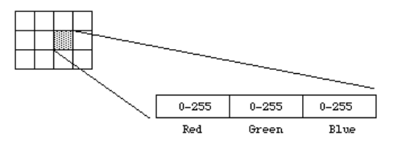
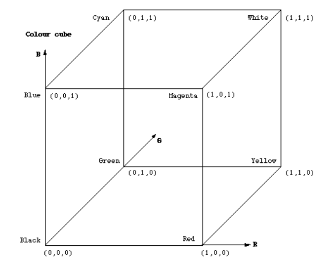
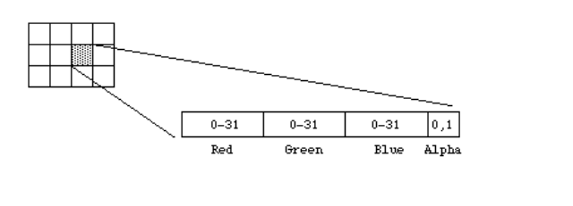
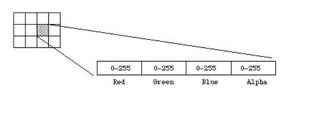
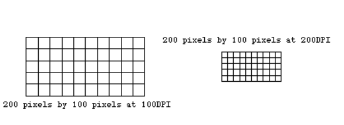

# Technical Overview

This document explains the core concepts behind LSB steganography and the image formats
that make it possible.

---

## Steganography vs. Cryptography

Cryptography is encrypting a message in plain sight — even if everyone knows the message
has been sent, they can't figure out what it means.

In steganography, we're hiding the fact that it's even there in the first place. Like
writing a message with invisible ink — only the person receiving this message would know,
and unbeknownst to anyone else reading it, the recipient can read the secret message.

---

## Least Significant Bit (LSB)

The most simple form of steganography is LSB, or "Least Significant Bit". It refers to
the rightmost bit in a binary number representation. Holding the lowest value, it's the
bit with the least amount of weight in a binary number. So we can change this bit to
contain our encoded message and have a near imperceptible change on the actual image
visually.

We'll change the last bit or last two bits of every byte in an image. Every byte has 8
bits, so changing the last two will keep the remaining six from the legitimate image —
and the two we changed carry our secret message.

---

## Image File Formats

For LSB steganography to work we need:

- **Predictable, stable pixel data.** Whatever you write into the pixels should come back
  exactly as written when you save and reopen the image.
- **No lossy compression.** A data encoding method that significantly reduces file sizes
  will scramble those least significant bits.

### BMP (Bitmap)

Provides uncompressed, raw pixel data.

- What you see in the file is basically the pixel array (plus a header).
- If you flip a bit in the pixel data and save, it stays flipped — perfect for LSB.

### PNG (Portable Network Graphics)

A raster image format known for lossless compression.

- The pixel data is compressed, but when decompressed, you get **exactly** the same bits
  you started with.
- So your hidden bits survive saving and reopening.

### JPEG (Joint Photographic Experts Group)

The most popular and widely used lossy compression format for digital images.

- Uses DCT (Discrete Cosine Transform) and quantization, which throws away "unimportant"
  detail.
- Those least significant bits you carefully modified are exactly the kind of detail JPEG
  destroys or changes.
- Result: your hidden message gets corrupted or completely lost.

**Core idea: BMP/PNG preserve your exact pixel bits; JPEG does not.**

---

## How Pixel Data is Stored in BMP

**Structure (simplified):**

- File header (metadata: size, dimensions, etc.)
- DIB header (more metadata)
- Optional color table (for indexed images)
- Pixel array (this is what you care about)

**Pixel array:**

- Typically stored as BGR or BGRA (Blue, Green, Red, Alpha) per pixel.
- Often stored bottom-up (first row in file is the bottom row of the image).
- Each channel is usually 8 bits.
- So a pixel might look like:
  - Blue: b7 b6 b5 b4 b3 b2 b1 b0
  - Green: g7 g6 g5 g4 g3 g2 g1 g0
  - Red: r7 r6 r5 r4 r3 r2 r1 r0
- LSB stego: you tweak b0, g0, r0 to encode your message bits.

---

## Bitmap Images and Color Depth

A bitmap is a rectangular grid of cells called pixels. Each pixel contains a color value.
They are characterized by only two parameters: the number of pixels, and the information
content or color depth per pixel.

### 1-bit (Black and White)

This is the smallest possible information content that can be held for each pixel. The
resulting bitmap is referred to as monochrome or black and white. Pixels with a 0 are
black, pixels with a 1 are white.

### 8-bit Greyscale

Each pixel takes 1 byte (8 bits) of storage, resulting in 256 different states. A value
of 0 is normally black, 255 is white, and 127 would be a 50% grey value. It's most
common to map the levels from 0–255 onto a 0–1 scale, but some programs will map it onto
a 0–65535 scale.

### 24-bit RGB

There are 8 bits allocated to each red, green, and blue component. For each component,
the value 0 refers to no contribution to that color and a value of 255 would be a fully
saturated contribution. Since each component has 256 different states there are a total
of 16,777,216 possible colours.

- Previously 8-bit grayscale had only 256 shades, whereas 24-bit RGB has 256 shades of
  red × 256 shades of blue × 256 shades of green = 256³ = 16,777,216

RGB colour space is a fundamental concept in computer graphics. In RGB space any colour
is represented as a point inside a colour cube with orthogonal axes r, g, b.

### 16-bit RGB

This is generally a direct system with 5 bits per colour component and a 1-bit alpha
channel.

### 32-bit RGB

This is normally the same as 24-bit colour but with an extra 8-bit bitmap known as an
alpha channel. This channel can be used to create masked areas or represent transparency.

---

## Resolution

Resolution determines the final size of a bitmap, because otherwise pixels inherently
don't have a size — just data for color values and the number of pixels. Typically
measured in pixels per inch (PPI) but could be measured with any unit of measurement. On
devices with non-square pixels the resolution may be specified as two numbers, the
horizontal and vertical resolution.

**Common measurements:**

- PPI (pixels per inch) for screens
- DPI (dots per inch) for printers

If you choose:

- **100 PPI** → 100 pixels fit into one inch
- **200 PPI** → 200 pixels fit into one inch (pixels are smaller)

Resolution being independent of the information content in bitmaps is a fundamental
concept. Since resolution determines the size of a pixel, it can also be used to modify
the size of the overall image.
